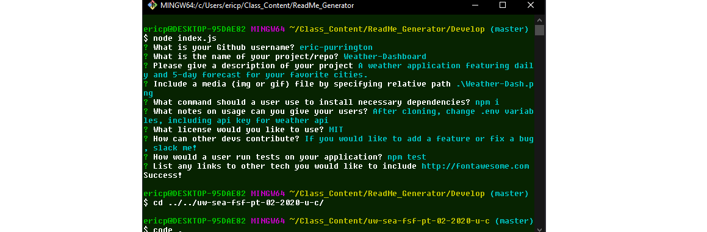

# ReadMe_Generator


## Description

A command line application that generates a ReadMe.md file equipped with: two badges, a table contents, a media file if you choose to include one, installation instructions, usage instructions, license, contributing instructions, how to run tests, and questions section.         
See questions asked and possible answers below.



## Table of Contents 

* [Installation](#installation)

* [Usage](#usage)

* [Contributing](#contributing)

* [Questions](#questions)


## Installation

To install necessary dependencies, run the following command:

```
npm i
```


## Usage

After cloning repo and installing necessary dependencies, run ``` node index.js ``` and prompts should begin to appear.


## Contributing

If you'd like to add a feature or fix something, slack me!


## Technology from others
Inquirer, Axios, and Shields.io for metadata badges

